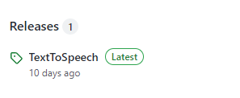
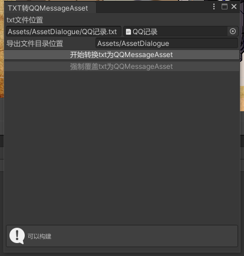
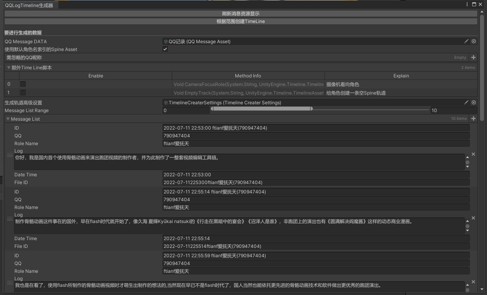
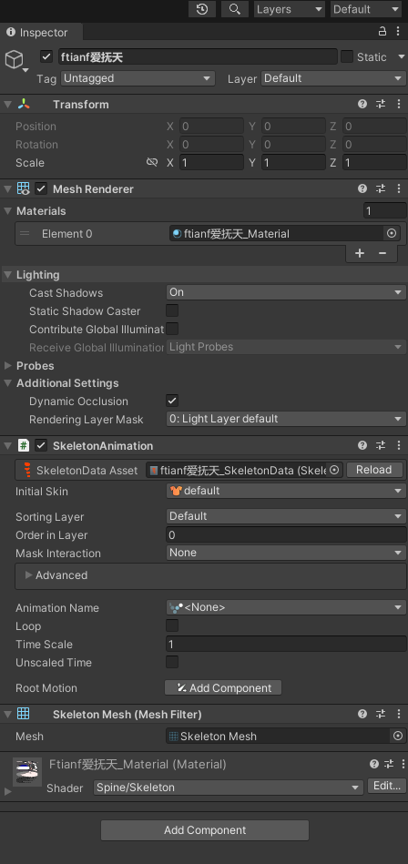
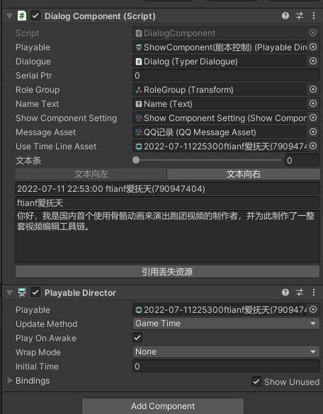
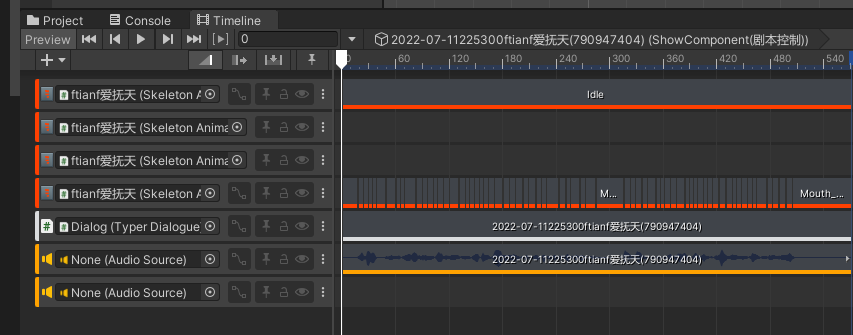

# TRPG-Logline
（教程未完成，随时会更新中）
TRPG-Logline是一款革命性的Unity插件，用于骨骼动画跑团视频的制作演出。
spine运行库版本为4.1，所操作的版本为Unity 2021.3.6f1。  
本教程建议对Unity基础操作有了解。

# 目录
- [TRPG-Logline](#trpg-logline)
- [目录](#目录)
- [导入](#导入)
- [使用](#使用)
- [工程配置](#工程配置)
- [编辑器操作](#编辑器操作)
- [时间线(Timeline)相关](#时间线timeline相关)
- [spine动画相关](#spine动画相关)
  - [默认](#默认)
  - [口型](#口型)
- [代码相关](#代码相关)
  - [添加扩展轨道脚本](#添加扩展轨道脚本)

# 导入
下载 https://github.com/ffftian/TextToSpeech   

并根据该软件说明录制/生成对应命名规范音频。将生成的音频和QQ记录log根据[工程配置](#工程配置)摆放在对应位置。
下载Unity对应版本，打开工程文件。   
工具栏中点击《QQ文本编辑器\TXT转QQMeesageAsset》拖拽您的记录放置在内，点击转换。   
   
工具栏中点击《QQ文本编辑器\QQLogTimeline生成器》
将生成的log拖入进QQMessageData。
拖动[MessageListRanage]指定生成范围。
点击[刷新消息资源显示]，可以看到MessageList将显示范围内对话。
每一句段落都将生成一段轨道片段，已生成轨道片段将跳过。
点击[根据范围创建Timeline]
如果一切顺利，生成段落的位置为Resources/QQTimeLine/<文件名>。您将在该文件夹中看到资源数据。

# 使用
Assets\Scenes文件夹点击模板场景   
点击场景中ShowComponent(剧本控制)   
从Assets\AssetDialouge中拖入文件到Message Asset   
点击文本条下的文本向左或向右，UseTimelineAsset将自动被赋值。
创建一个带有SkeletonAnimaiton的角色预制体。
将预制体角色拖拽到RoleGroup下.
。
。   
双击UseTimeLineAsset 中的对象。如果一切正常Timeline编辑器将被唤出，并且您的骨骼动画文件也将被自动置入到轨道上，口型也自动生成。您就可以开始播放并使用了。
。

# 工程配置
未提及目录则无需操作上的注意。  
AssetDialogue = 存放原始log的位置。  
AssetSpeak = 存放每名角色音频的位置。  
AssetSpine = 存放每名角色骨骼动画实体的位置。
PipeLine = 渲染管线相关，如不了解勿动。  
Prefab = 预制体位置。  
Presentation Material = 教程时使用的工程文件（可删除）  
Resources/QQTimeLine = 自动生成的轨道动画读取位置，不建议从文件夹预览  
Scenes = 场景摆放位置
ScriptExtension = 额外轨道生成脚本扩展，扩展轨道生成参考[添加扩展轨道脚本](##添加扩展轨道脚本)  
ShowScript = 如有编程需要，建议将您写的脚本放置于此。  
Sources = 资源目录。  
TRPGEditorSetting = 本插件的配置文件。  

# 编辑器操作

# 时间线(Timeline)相关

# spine动画相关
## 默认
默认动画的名称需命名为idle，当创建轨道时会自动等同于音频时间的创建idle动画，并循环播放。
## 口型
在spine Anmation中新建一个文件夹Mouth。
所有张嘴口型动画以Mouth_MouthO[x]命名
所有闭嘴口型以Mouth_MouthC[x]命名
(x代表0-9)
在动画中只需要为调整自己的嘴型附件。
声音越响时，调用的张嘴口型数值越大。
闭嘴口型则用于衔接同名的张嘴口型，在声音低于阈值时调用。
一般建议制作序号1到序号5种的MouthO/MouthC既足够表现说话了。

# 代码相关
以下内容默认您对在Unity中用C#编程具备一定了解。
## 添加扩展轨道脚本
轨道扩展示例位于 Assets/ScriptExtension
在使用IDE时，会分为两个IDE
Assembly-CSharp中的TimelineSelectExtension
TimelineSelect用于DialogComponent在选中Timeline资源时，直接将场景中特定对象赋值给特定轨道脚本。
扩展可以在相似位置安装相同格式创建静态类并添加静态函数。
并以TimelineSelectAttribute特性包装静态函数。

Assembly-CSharp-Editor中的 Editor/TimelineCreaterExtension
QQLogTimelineOdinEditorWindow在动态创建轨道时，会进行额外轨道的赋值。

